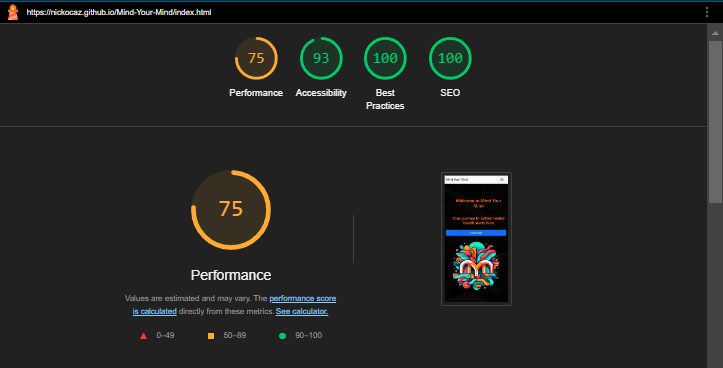

### Mind Your Mind 

### Introduction
*Your guide to peaceful living*.

Welcome to Mind Your Mind, a thoughtfully designed web application focused on promoting mental well-being through accessible and beginner-friendly information. Our platform is dedicated to providing users with essential mental health resources, helping you recognise common issues, manage stress effectively, and access further support.

*[Live project available here](https://nickocaz.github.io/Mind-Your-Mind/)*

---

### Table of Contents
- [Introduction](#introduction)
- [UX Design](#ux-design)
  - [Client Goal](#client-goal)
  - [User Goal](#user-goal)
  - [User Stories](#user-stories)
  - [Development Goal](#development-goal)
- [Cooperation with A.I.](#cooperation-with-ai)
  - [A.I. Introduction for software development](#ai-introduction-for-software-development)
  - [A.I. Goals](#ai-goals)
  - [Using A.I. for research and image creation](#using-ai-for-research-and-image-creation)
  - [Using A.I. for application creation](#using-ai-for-application-creation)
  - [Using A.I. for problem solving / bug fixes](#using-ai-for-problem-solving--bug-fixes)
- [Wireframe design](#wireframe-design)
- [Colors](#colors)
- [Fonts](#fonts)
- [Features](#features)
- [Testing and Validation](#testing-and-validation)
- [Deployment](#deployment)
- [Bugs](#bugs)
- [Built With](#built-with)
- [Content Research](#content-research)
- [Media](#media)
- [Testing](#testing)
- [Future improvements](#future-improvements)

---
### UX Design

#### Client Goal
- A welcoming webpage that provides basic mental health information.
- A clean and supportive design.
- A calming and well-organized user experience.

#### User Goal 
- Beginner-friendly information on mental health, including how to recognise common issues and manage stress.
- Information presented in a supportive and organized layout.

#### User Stories

- As a user, I want to navigate easily through the website quickly via a menu/menu bar.
- As a user, I want to understand the purpose of the website immediately upon arrival so that I can get a visual understanding of the services offered.
- As a user, I want to quickly see an overview of the services offered so that I can determine if they meet my needs.
- As a user, I want to find relevant information easily.
- As a user, I want to access self-help techniques and coping strategies so that I can manage my mental health or support others effectively.
- As a user, I want to access resources for further support and other agencies.
- As a user, I want access to social media accounts to follow for additional info.
- As a user, I want to contact the page owner for further information.

#### Development Goal

- Hero Section with Positive Messaging.
- Responsive navigation.
- Encouraging message about mental health (Positive Affirmation).
- Calming color scheme.
- Visually appealing way to organize content.
- Information Cards presenting mental health tips.
- Resource Links.
- Contact form.

[Back to Top](#Top)

---
### Cooperation with A.I.
A.I. will be utilized throughout this project's development to enhance efficiency, accuracy, and innovation and also implemented if required to identify bugs and code optimization. Any suggestion provided by A.I. will be questioned for an explanation to gain a deeper understanding and learn from the offered information. All information obtained via A.I. has been scrutinized and cross-referenced to ensure its validity.

#### A.I. Introduction for software development

A.I. helps identify and fix bugs faster, improving the overall quality of the software. Additionally, AI-driven tools can analyze vast amounts of data to provide insights, optimize code, and predict potential issues, leading to more robust and scalable applications. Embracing AI in software development not only accelerates the development process but also opens up new possibilities for innovation and problem-solving.

#### A.I. Goals

- Incorporate A.I. as a partnership in the development of this project.
- Automate repetitive tasks.
- Explore ideas with A.I. to assist in generating a theme and imagery.
- Image Creation.
- Suggestions for research.
- Bug fixing and optimization.

## Using A.I. for research and image creation.

### Co Pilot utilized for:

- Generating Topics for Mental Health.
- Asking Copilot for ways to combat mental health issues.
- Refined requests for more detailed and specific suggestions.
- Image Creation.
- Requested high-quality cartoon-style images to represent different mental health-related activities.
- Provided feedback to refine the style and specificity of the images.
- Adjusted the request to get comic-style illustrations without a superhero theme.
- Being Specific for Best Results.
- Clarified and adjusted image styles (from cartoon to caricature to comic).
- Ensured descriptions were precise to get the desired quality and tone.
- Iterated through multiple generations to perfect the visuals.

By specifying my needs and providing clear questions, I was able to harness Copilot’s capabilities effectively, resulting in suitable material.

## Using A.I. for application creation.

### Co Pilot utilized for:

- Streamlining tasks and saving valuable time. Its implementation was focused on enhancing efficiency and productivity without replacing the essential human touch and creativity.
- Bootstrap Navigation Bar.
- Request to create a responsive Bootstrap navigation bar.
- Request to add dropdown menus within the navigation bar.
- Adding Lists.
- Request to add an unordered list to cards.
- Bootstrap form.
- Request to add input validation to the form fields.
- Modals pop-up with feedback when form complete.

## Using A.I. for problem solving / bug fixes.
### Co Pilot utilized for:
When encountering an issue centering inline items, I turned to Copilot for assistance. While initial attempts to correct the code didn't fully solve the alignment issue, Copilot identified an unclosed div tag that might have been missed otherwise. This discovery not only highlighted the importance of attention to detail in coding but also demonstrated how AI can aid in debugging and improving code efficiency.

As Co Pilot is installed on VSCode it was easily accessible when issues occurred. Before making my final deployment I have asked Co Pilot to check through the code and it was unable to identify any obvious issues.

[Back to Top](#Top)

---

### Wireframe design.

[Back to Top](#Top)

---

#### Colors

The color palette for this project has been inspired by the logo to keep consistency in the design.

- #E7FCF0 - Background color.
- #CFFAE2 - Card.
- #522500 - Text.
- #E98400 - Titles and footer.

[Back to Top](#Top)

---

### Fonts

#### Subtle Font Change
The font choice for this project has been carefully selected to ensure readability. By using a subtle font change, we aim to enhance the user experience without causing distraction. The primary font is chosen for its clean and modern look. This approach helps maintain a cohesive and professional appearance throughout the website.

[Back to Top](#Top)

---

### Features

- Responsive for all devices.
- Hero header with a call to action for making contact.
- Information cards giving brief guidelines on mental health symptoms.
- Information cards giving brief guidelines on self-help.
- Footer with social links.

[Back to Top](#Top)

---

### Testing and Validation

- HTML Validation

- CSS Validation

- Lighthouse 

[Back to Top](#Top)

---

### Deployment

Here's how to set up a GitHub repository using the Code Institute Template, ensuring that all necessary dependencies are included when opening within the Gitpod IDE:

- Login to GitHub: Log in to your GitHub profile.
- Navigate to Template: Go to the Code Institute Full Template.
- Create New Repository: Click the dropdown for 'Use this template' and select "Create a new repository".
- Name and Describe: Provide the necessary name and description for your repository, then click 'Create repository from template'.
- Now able to open in VSCode that now gives access to the repository.
- Work in Gitpod: You can now work on your repository within the Code Institute Gitpod IDE workspace.

Early Deployment: Once the project repository is created, perform an early deployment for the live project. This allows for early and continuous testing using various devices, as well as utilizing Dev Tools available within browsers.

[Back to Top](#Top)

---

#### Bugs

- BUG - Initially there was a conflict between a flexbox and Bootstrap grid within the hero section.
- RESOLVED - Due to the time constraints of this project it was more convenient to rewrite the grid solely with Bootstrap. This fixed the bug.

[Back to Top](#Top)

---

### Built With
Technologies and Languages
- VS Code
- GitHub
- CodePen (running test code sample quickly)
- CoPilot

[Back to Top](#Top)

---

### Content Research

**Project brief and learning from Code Institute** - [Neurodiversity Design System](https://codeinstitute.net/)*

**Bootstrap Docs** - *[Bootstrap Docs](https://getbootstrap.com/docs/5.3/getting-started/introduction/)*

**British Dyslexia Association** - *[Dyslexia friendly style guide - British Dyslexia Association](https://www.bdadyslexia.org.uk/advice/employers/creating-a-dyslexia-friendly-workplace/dyslexia-friendly-style-guide)*

**Neurodiversity Design System** - *[Neurodiversity Design System](https://neurodiversity.design/)*

**Google Fonts** - [How type influences readability](https://fonts.google.com/knowledge/readability_and_accessibility/how_type_influences_readability/)

**Mind** - [Mental health facts and statistics](https://www.mind.org.uk/media/7581/mental-health-facts-and-statistics.pdf)

**NHS** - [Stress](https://www.nhs.uk/mental-health/feelings-symptoms-behaviours/feelings-and-symptoms/stress/)

**Windows Alt Codes for Special Characters, Signs & Symbols** - [Alt Code Unicode](https://altcodeunicode.com/)

[Back to Top](#Top)

---
### Media

[Google Fonts](https://fonts.google.com/)

[Font Awesome](https://fontawesome.com/)

[Back to Top](#Top)

---

### Testing
https://validator.w3.org/

https://jigsaw.w3.org/css-validator/

Jigsaw via Chrome development tools.

[Back to Top](#Top)

---

### Future improvements

- Style nav bar
- Add an Events Calendar
- Integrate a functional events calendar into the site to keep users informed about upcoming events and activities.
- User Posts Page
- Update the contact form on the user posts page.
- Include a button to specify if the message is a general enquiry or a submission for potential publication on the site.
- Accessible Policies in Place for Safeguarding and Confidentiality
- Ensure that all policies related to safeguarding and confidentiality are easily accessible to users.
- Improve Resources Menu
- Enhance the layout and organization of the resources menu for better user experience.
- Flip Card for Resources
- Implement flip cards for resources. When a user hovers over a card, it will display more details about the resource before they decide to follow the link.

[Back to Top](#Top)
